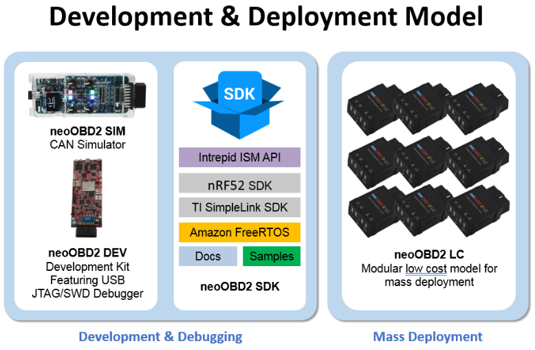
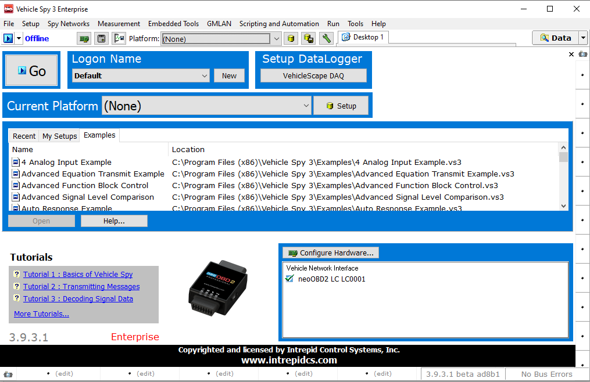
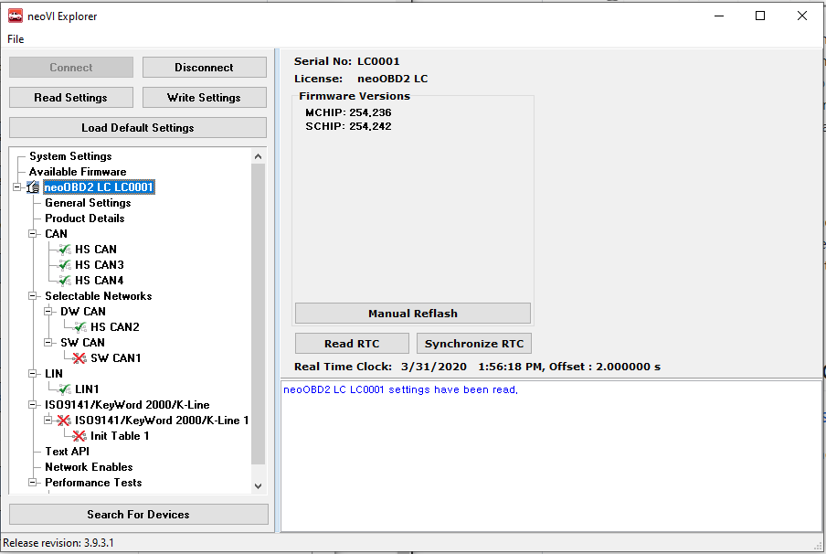
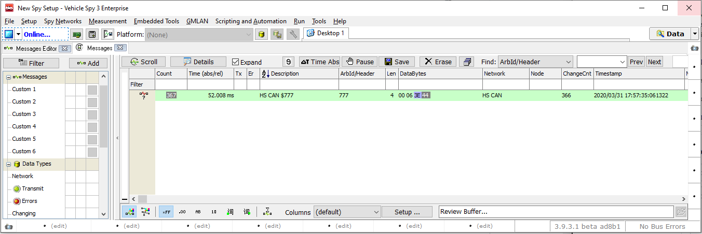

# Getting Started with neoOBD2 DEV Hardware

Thank you for purchasing neoOBD2 DEV. This guide provides the configurations needed to setup your neoOBD2 DEV hardware for development. 

neoOBD2 DEV is a versatile development kit for building a wireless vehicle-network applications using Wi-Fi and Bluetooth Low Energy. The development kit provides the following core features:

- Vehicle networks: 3x CANFD, 1x SW-switchable CANFD / SWCAN, 1x SW-switchable LIN / KLINE
- Wi-Fi: Texas Instruments CC3235SF Simplelink Wi-Fi MCU
- BLE: Nordic Semiconductor nRF52840 Bluetooth 5 SoC
- Complete Vehicle Spy Enterprise support including online and standalone scripting features.

## Prerequisites

Required Hardware:

1. [neoOBD2 DEV](https://www.intrepidcs.com/products/vehicle-network-adapters/neoobd2/)
2. [neoOBD2 SIM](https://store.intrepidcs.com/neoECU-CHIP-Simulator-p/neoobd2-sim.htm) (Optional / highly recommended)
3. [USB-A to USB-C USB 2.0 or 3.1 Cable](https://store.intrepidcs.com/USB-2-0-Cable-p/microusb-usb-cable.htm)
4. [SB-A to Micro-B USB 2.0 Cable](https://store.intrepidcs.com/USB-3-0-to-USB-C-Cable-1-meter-3-p/usb3-usbc-cable.htm)
5. [12V DC Power Supply with Barrel Jack Connector](https://store.intrepidcs.com/productdetails_popup.asp?productcode=NEOVI-PS)

Required Software:

1. [Vehicle Spy Enterprise](https://store.intrepidcs.com/Vehicle-Spy-p/vspy-3-ent.htm)

    [Vehicle Spy Enterprise](https://store.intrepidcs.com/Vehicle-Spy-p/vspy-3-ent.htm) is a single tool for diagnostics, node/ECU simulation, data acquisition, automated testing, and in-vehicle communication networks bus monitoring.
    
    For introduction, tutorials, and documentations on Vehicle Spy Enterprise, please [click here](https://cdn.intrepidcs.net/support/VehicleSpy/vehiclespyhelpdoc.html).

2. [Texas Instruments Code Composer Studio IDE](https://software-dl.ti.com/ccs/esd/documents/ccs_downloads.html)

## The neoOBD2 Development and Mass-deployment Model

The neoOBD2 family of products provide a unique model that spans the life cycle of a product from the initial software prototyping & development phase to the mass deployment & maintenance phase.

- neoOBD2 DEV (prototyping & development): Full-featured neoOBD2 hardware in development board form-factor. Contains onboard USB-JTAG/SWD debug probes for debugging and programming the ARM Cortex M4 Wi-Fi and BLE SoCs.  
- neoOBD2 LC (mass deployment): Modular mass deployment device in OBDII dongle form-factor, absent onboard debug probes. This model is typically custom made-to-order based on the features identified by the end user.
- neoOBD2 SDK: Published SDK available on GitHub with documentation and sample projects for building Wi-Fi and BLE enabled vehicle network applications for ARM Cortex M4 applications processors on the TI CC3235SF Wi-Fi and Nordic nRF52840 BLE SoC, using the Intrepid Secure Module (ISM) vehicle network API.

While the neoOBD2 DEV and neoOBD2 LC exhibit different form factors, they are based on the identical hardware design. This allows the embedded software that was developed and hardened using the neoOBD2 DEV to be mass flashed and deployed on neoOBD2 LC without any software changes. 

Simply put, the neoOBD2 DEV provides the full-featured development environment for the engineering team to develop, debug, and test the applications. The neoOBD2 LC is used to deploy the released applications in mass scale.

## Powering Up your neoOBD2 DEV

The neoOBD2 DEV can only be powered via its Male OBDII Connector. The device cannot be powered via USB.

The GND and VBATT pins on the Male OBDII Connector can be connected to a DC power source that provides 4.5V - 36V. This includes OBDII port found in a vehicle or a custom-built harness with GND on pin 4 and VBATT on pin 16 of a Female OBDII Connector. We recommend using a 3A 12V DC power supply for general use. A standard 12V DC power supply with barrel jack connector is available for purchase from Intrepid [here](https://store.intrepidcs.com/productdetails_popup.asp?productcode=NEOVI-PS).

The most convenient way to power a neoOBD2 DEV is by using a [neoOBD2 SIM](https://store.intrepidcs.com/neoECU-CHIP-Simulator-p/neoobd2-sim.htm). It is a programmable 2-channel CAN simulator that comes with a Female OBDII Connector, just like the OBDII connector found in a vehicle. This allows you to conveniently connect any OBDII device to provide power and simulated CAN traffic for easy development. The neoOBD2 SIM is powered by a standard barrel jack 12V DC 3A power supply and outputs power via its Female OBDII Connector.

## OBDII Connectors and Pin Map

The Male OBDII connector on the neoOBD2 DEV ships with the following default pin mapping:

The neoOBD2 DEV also features support for a Neovi Universal Connector (NUC) board. The board allow OBDII pin mappings on the Male OBDII connector of the neoOBD2 DEV to be customized so that they are compatible with the pin mapping found on vehicle OBDII port users would like to connect to.
    
## USB-A to USB-C USB 2.0 or 3.1 Cable

A standard off-the-shelf USB-A to USB-C USB 2.0 or 3.1 cable can be used to connect the neoOBD2 DEV to a PC running Vehicle Spy Enterprise.

## USB-A to Micro-B USB 2.0 Cable

Standard off-the-shelf USB-A to Micro-B USB 2.0 cables can be used to make the following connections:

- Connect to the TI XDS110 onboard USB-JTAG debug probe for programming and debugging the TI CC3235SF Wi-Fi SoC.
- Connect to the ARM DAPLINK onboard USB-SWD debug probe for programming and debugging the Nordic nRF52840 BLE SoC.
- Connect to the BG96 to perform firmware updates.

## Install Vehicle Spy Enterprise and Configure Basic Hardware Settings

1. Run the offline installer provided with your purchase of **Vehicle Spy Enterprise**. Please [contact Intrepid Control Systems](https://www.intrepidcs.com/support/contact-support/) for a version of installer that is compatible with your neoOBD2 DEV.

2. Let's power up your neoOBD2 DEV. If you have a **neoOBD2 SIM** connect the **12V DC Power Supply** to neoOBD2 SIM via its barrel jack connector. Then, simply connect the neoOBD2 SIM to power the neoOBD2 DEV via the 16 pin male OBDII connector. If you do not have a neoOBD2 SIM, you can create a custom cable with a Female OBDII connector with GND on pin 4 and VBATT on pin 16. Then, supply 4.5V - 36V DC through the cable. This will provide power to the neoOBD2 DEV. Verify that the first three status LEDs from the left to right on your neoOBD2 DEV are all blinking in orange as shown below. The orange color indicates that the neoOBD2 DEV is not connected to Vehicle Spy and both the WiFi and BLE chips are running the default bootloader.

    

3. Plug in the **USB-A to USB-C USB 2.0 or 3.1 Cable** to establish connection between your PC and neoOBD2 DEV. Open Vehicle Spy Enterprise. Verify Vehicle Spy Enterprise is able to detect your neoOBD2 DEV. The LED indicated in the image below will exhibit a blinking pattern in white color if your PC has successfully enumerated the neoOBD2 DEV.

    ")

    

4. Select **Setup** from the top menu and select **Hardware**. This will open the **neoVI Explorer**, a common hardware configuration tool for all hardware interfaces from Intrepid Control Systems. Click the **Connect** button to connect to your neoOBD2 DEV. This will read hardware settings from the connected neoOBD2 DEV. Verify the networks you wish to use are enabled. If any of the three available firmware versions need to be updated, click the **Manual Reflash** button and wait for the firmware update process to come to completion. Make sure to click the **Write Settings** button to commit any changes before closing the Hardware view.

    

5. Click the **Play** button located on the top left corner of the screen. Verify Vehicle Spy Enterprise properly transitions to **Online** state. If the neoOBD2 DEV is connected to a live CAN bus, you will be able to view all CAN message traffic from the **Messages** view. While in online state, the status LED will exhibit a blinking pattern that transitions rapidly between green and blue.

    

## Install Texas Instruments Code Composer Studio

1. Browse to the **[TI Code Composer Studio IDE download page](http://processors.wiki.ti.com/index.php/Download_CCS)**.

2. Download the offline installer of the latest TI Code Composer Studio. 

3. Unzip and run the offline installer.

4. When prompted to select **Product Familes** to install, choose **SimpleLink Wi-Fi CC32xx Wireless MCUs**.

5. Accept default settings for debugging probes, and then choose **Finish**.

## Result

At this point, your neoOBD2 DEV device is configured for use with Vehicle Spy Enterprise software. During the development process, Vehicle Spy Enterprise will be **required to program the application binary into the CC3235SF Wi-Fi SoC and the nRF52840 BLE SoC**. Vehicle Spy Enterprise is also **required to configure callbacks for receive messages you want to capture from your applicationns running on the Wi-Fi and BLE SoCs.**

Your neoOBD2 DEV is ready for TI CCS, which provides a powerful integrated development environment for your projects and supports real time USB debugging via the built-in XDS110 USB-JTAG debug probe.

Your neoOBD2 DEV is also ready for embedded Integrated Development Environment tools for ARM to do BLE application development. The ARM MBED DAPLINK program / debug interface inside your neoOBD2 DEV allows you to do development with nRF52840 BLE SoC.

## What's Next?

Start developing Wi-Fi applications by following the step-by-step guide for **[Getting Started with Wi-Fi Development on neoOBD2 DEV](OBD2DEV_WIFI_GETTING_STARTED.md).**

Start developing BLE applications by following the step-by-step guide for **[Getting Started with BLE Development on neoOBD2 DEV](OBD2DEV_BLE_GETTING_STARTED.md).**
