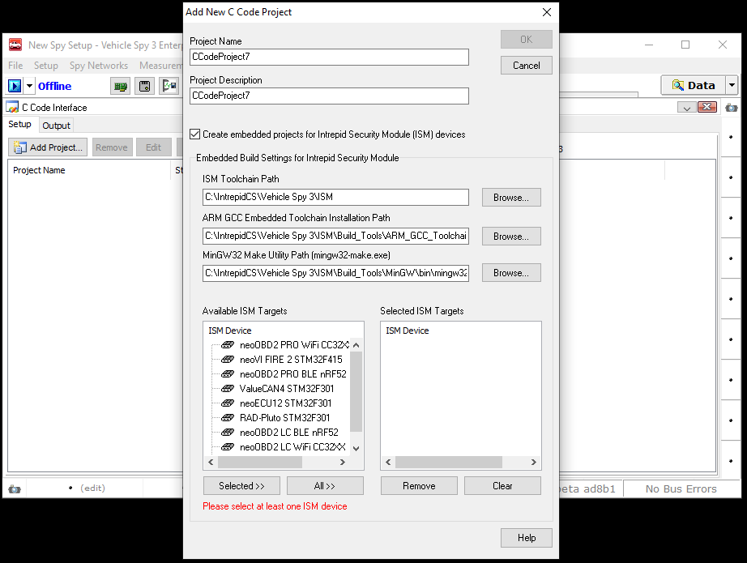
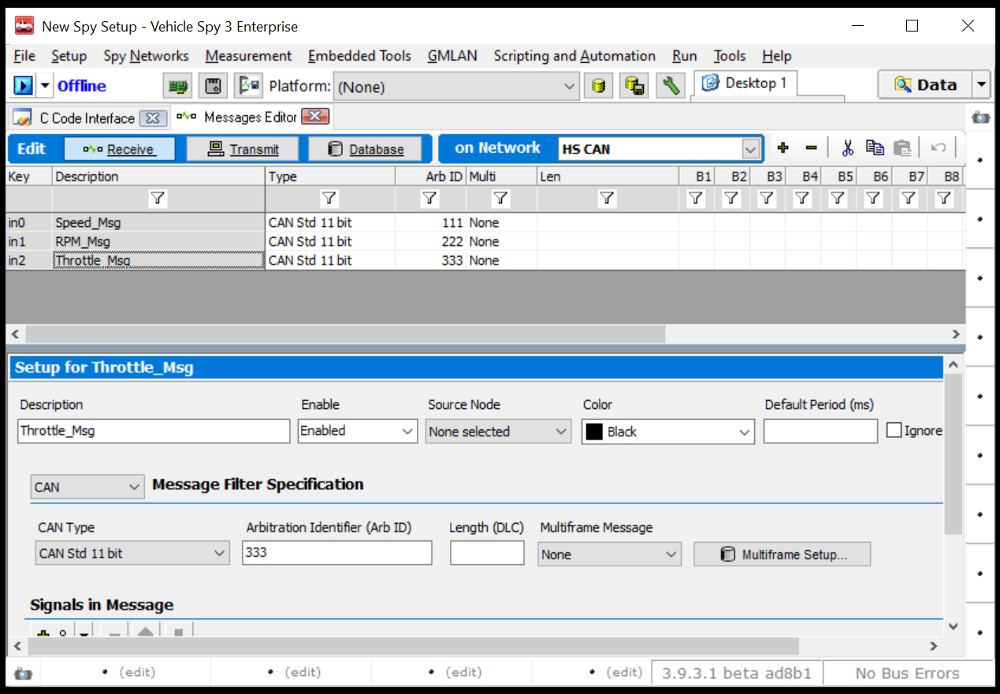
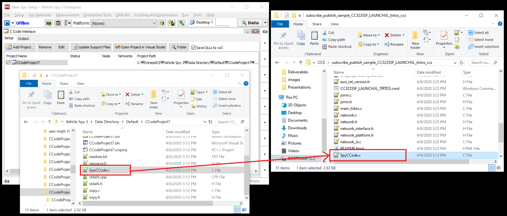
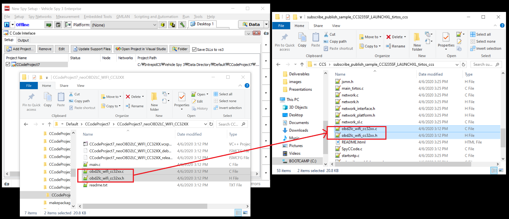
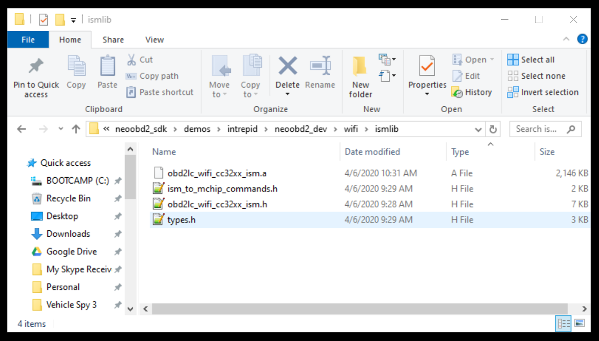
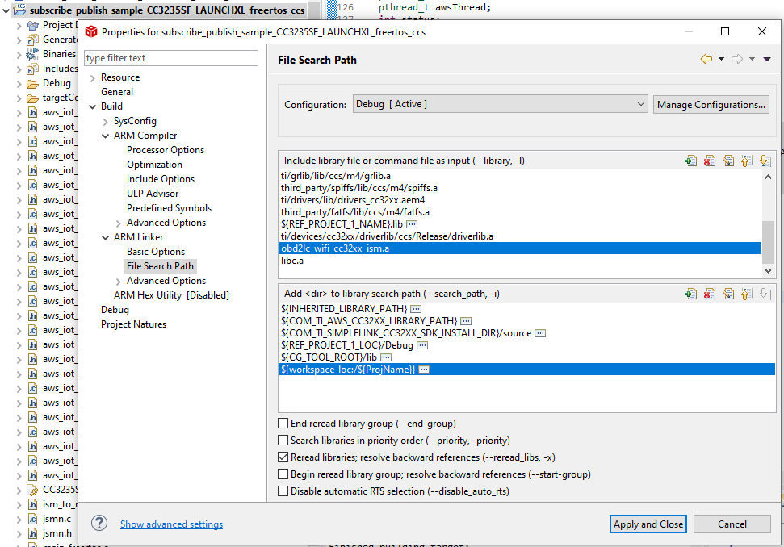

# Getting Started with your first Wi-Fi Application for neoOBD2 DEV

This guide provides a step-by-step guide on creating, debugging, and deploying a sample ready-to-build TI CC3235SF Wi-Fi application for neoOBD2 DEV. This sample project is available in the neoOBD2 SDK. The application is an extension of the "Subscribe Publish" example application available in the Simplelink AWS IoT Plugin for CC32XX. Intrepid has modified the original example to send data elements gathered from several CAN messages to the AWS Iot Core using MQTT publish. In addition, the example receives an arbitrary data of up to 8 bytes and propgate that data out to the CAN network as a transmit CAN message.

You will learn to do the following:

* Use the CC32XX Simplelink SDK and Simplelink AWS IoT Plugin in CC3235SF to communicate with AWS IoT Core using MQTT.
* Use the Intrepid Secure Module (ISM) API in CC3235SF to transmit and receive CAN messages configured from the C Code Interface view of Vehicle Spy Enterprise.
* Publish received CAN signals in realtime to AWS IoT Core using MQTT.
* Subscribe to a topic to receive some arbitrary data up to 8 bytes and transmit that data as a CAN message.

When the sample application is properly configured and programmed into the CC3235SF Wi-Fi processor, the neoOBD2 DEV will perform the following:

* Initialize and enable the CC3235SF's Wi-Fi subsystem.
* Initialize various peripherals and the ISM API library.
* Received CAN messages are processed by the receive message event handler callback functions.
* A CAN message is transmitted on 100msec interval.
* Provision *certificate and private key* needed to connect to the AWS IoT Core.
* Use user-configured *Wi-Fi credentials* to connect to a Wi-Fi Access Point in station mode.
* Connect to the MQTT endpoint address of your AWS IoT Core account.
* Publish a payload containing the *"Vehicle Speed, Engine Speed, and Throttle Position"* data parsed from the receive message event handlers to the *obd2dev/demo/data* topic on 500msec interval.
* Subscribe to a topic containing arbitrary data upto 8 bytes that can be transmitted out as a CAN message on 100msec interval.

## Prerequisites

Required Hardware:

1. neoOBD2 DEV
2. neoOBD2 SIM (Optional / highly recommended)
3. USB-A to USB-C USB 2.0 or 3.1 Cable
4. USB-A to Micro-B USB 2.0 Cable

Required Software:

1. neoOBD2 SDK

2. Vehicle Spy Enterprise

    [Vehicle Spy Enterprise](https://store.intrepidcs.com/Vehicle-Spy-p/vspy-3-ent.htm) is a single tool for diagnostics, node/ECU simulation, data acquisition, automated testing, and in-vehicle communication networks bus monitoring.
    
    For introduction, tutorials, and documentations on Vehicle Spy Enterprise, please [click here](https://cdn.intrepidcs.net/support/VehicleSpy/vehiclespyhelpdoc.html).

3. TI Code Composer Studio (CCS) IDE - download [here](http://www.ti.com/tool/download/CCSTUDIO)

4. TI Simplelink CC32XX Plugin for AWS IoT Core - download [here](http://www.ti.com/tool/download/SIMPLELINK-CC32XX-PLUGIN-FOR-AWSIOT)

Other requirements:

1. AWS IoT account with access to the AWS IoT console - [create one here](https://aws.amazon.com)

## Import, Build, and Run the AWS CC32XX Plugin for AWS IoT Core

First, let's import, build, and run the *subscribe_publish_sample_CC3235SF_LAUNCHXL_freertos_ccs* project provided in the plugin.

1. Download and install the [AWS CC32XX Plugin for AWS IoT Core](http://www.ti.com/tool/download/SIMPLELINK-CC32XX-PLUGIN-FOR-AWSIOT).

2. Navigate to the install directory of the plugin and locate the **AWS_Quick_Start_Guide.html** under <install_path>/docs/aws. Open the guide.

3. You may jump to the **Hardware Setup** section. You will notice the **Jumper Settings** section describes the sense-on-power scheme. The SOP pins 0 - 2 on the neoOBD2 DEV is indicated below. 

	

4. Follow the rest of the guide exactly as shown. Make sure to follow the **Example Pre-Build Steps** section of the guide to properly configure the certificates and the Wi-Fi credentials in the **aws_iot_config.h**.

Once you have completed the above steps, you should be able to build and debug your project on the neoOBD2 DEV to establish MQTT pub/sub between the CC3235SF and your AWS IoT Core endpoint. 

Next, we will work on adding the auto-generated C codes from Vehicle Spy's **C Code Interface** tool and the **ISM API library** to expand the sample application to access the CAN network simultaneously while communicating with AWS IoT Core.

## Importing auto-generated ISM codes from Vehicle Spy Enterprise

The **ISM library (obd2lc_wifi_cc32xx_ism.a)** and a set of **auto-generated ISM source files (obd2lc_wifi_cc32xx.c, obd2lc_wifi_cc32xx.h, and SpyCCode.c) from Vehicle Spy Enterprise** are the software components that grant the code running on CC3235SF transmit and receive access to data over the vehicle networks supported by neoOBD2 DEV.

Please complete this section to learn how to generate and import the above files into the project as they are essential parts of Wi-Fi application development process using the neoOBD2 DEV.

1. Open Vehicle Spy Enterprise. Go to the **Scripting and Automation** menu and select **C Code Interface.** 

2. Click **Add Project...** button and select **New Project...**

3. Click the **Create embedded projects for Intrepid Security Module (ISM) devices** checkbox to inflate additional view.

	

4. Select **neoOBD2 LC WiFi CC32XX** from the list of available ISM targets and add it to the selected ISM targets list. Click **OK** button to generate ISM source files. Note that Visual Studio will open if you have Visual Studio installed on your PC.

5. Let's add the three CAN messages that will each hold a 2-byte CAN signal; vehicle speed, engine speed, and throttle position. Go to the **Messages Editor** and add three messages under the **Receive** tab as follows.

	
	
6. Create event handlers for the three CAN messages. Go to **C Code Interface** and click the **Edit** button to open the **C Code Module Setup** view. navigate to the **Message Events** tab where you will see the three receive messages that were created in the previous step. Double click to add all of them to the list box on the right.

Navigate to the **Event Handler Code** tab. Click the **Copy** button to copy the generated code stub to the Windows clip board. Click the **OK** button to exit the **C Code Module Setup** view.

Once you are back to the **C Code Interface** view, click the **Update Support Files** button.

**IMPORTANT:** Before proceeding further, save the Vehicle Spy Enterprise project (.vs3) by going to **File** on top menu and selecting **Save**. The saved .vs3 project will be used later to program the completed application into the CC3235SF in neoOBD2 DEV.

7. Go back to the **C Code Interface view**. Click the **Folder** button which will open up a file explorer in the root directory of the generated C Code Project. 

	
	
8. Open the **SpyCCode.c** file in a text editor and paste the **Event Handler Code** stub that you copied from step 6.

	

9. Copy the **SpyCCode.c** file and add it into the CCS project directory.

	
	
10. Go back to the file explorer. Open the **ProjectName_neoOBD2LC_WIFI_CC32XX** folder. Copy **obd2lc_wifi_cc32xx.c** and **obd2lc_wifi_cc32xx.h** files and paste them into the CCS project directory.

	

11. Open project properties in CCS and verify the **BUILD_OBD2LC_WIFI_CC32XX_ISM_PROJECT** is defined in **Predefined Symobls** list.

	

12. We need to add a few more ISM API source files. Navigate to path <neoobd2sdk_path>\demos\intrepid\neoobd2_dev\wifi\ismlib. Copy all files and paste them into the CCS project directory.

	
	
13. Open project properties in CCS and go to **File Search Path** under **ARM Linker**. Add **obd2lc_wifi_cc32xx_ism.a** in the first list box. Add **${workspace_loc:/${ProjName}}** in the second box. Make sure **Reread libraries** option is checked.

	

14. Build the CCS project and verify the project builds successfully.

The ISM API glue codes and library are now all integrated into the project, but they are not actually being executed as we have not added any codes that exercise the library. Next, we will add codes to enable vehicle network communication. This will allow you to receive and transmit CAN messages from the project. Furthermore, we will add codes to forward the CAN data to AWS IoT Core and transmit data received from AWS IoT Core in a CAN message.
	
## Add Codes to Facilitate CAN Rx and Tx with AWS IoT Core

1. From the project explorer, open the **aws_iot.syscfg** file. From the menu window that pops up, delete the following peripherals.
	- SPI
	- DMA
	- GPIO

	These peripherals are already in use by the ISM API library (obd2lc_wifi_cc32xx_ism.a). If you attempt to compile with the above peripherals defined in the **aws_iot.syscfg** file, the compiler will throw an error saying some of the functions are re-defined. 

	First, choose SPI from the list and click the **Remove All** button. You will notice DMA automatically removed when SPI is removed. Then, choose GPIO from the list and click the **Removal All** button.

	Verify that only the following are enabled from the **TI Driver** list.
	- Display
	- Power
	- RTOS
	- UART

	***Please note that the following peripherals are used by the ISM API library (obd2lc_wifi_cc32xx_ism.a), and are not available for your application.***
	- GSPI
	- Timer0
	- GPIO (*GPIOs are not available for user applications*)

2. Let's start making some code changes. Go to the main() function in **main_freertos.c**. Comment out or delete the GPIO calls.

	")

3. Next, go to **networks.c** and remove the GPIO calls.

	Remove GPIO calls from network_startup():
	
	")
	
	Remove GPIO calls from initWiFi():
	
	")

4. Let's implement the Receive Message Event Handlers in **SpyCCode.c**.

## Running and Debugging the Application
	
Now that you have successfully imported and built your first sample Wi-Fi project, you can run the application in debug mode via the on-board CC3220SF USB debugger. You can sign in to your AWS IoT cosole to verify that the neoOBD2 DEV is talking to AWS IoT core.
	
## Programming the Application into neoOBD2 DEV

Once your Wi-Fi program is ready to be deployed in neoOBD2 DEV, you can use Vehicle Spy to do so.

The CC3220SF Wi-Fi module in neoOBD2 DEV is programmed with an application bootloader at production, which allows Vehicle Spy to program application binary. The application bootloader is always executed first from external secure FLASH. If the application bootloader detects a valid application in the external FLASH, it will load it into its internal FLASH and begin execution. Otherwise, the application bootloader will wait indefinitely for Vehicle Spy to send a valid application. 

## What's Next?

Now that you are able to import, debug, and program a sample project: 

